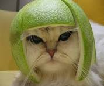

# DescribeImage

Use LLMs that are running locally (or on a server defined in `OLLAMA_HOST`) to describe the given images.

This repository contains a command line utility that can be used to describe images with Ollama.

## Requirements

### Run-time requirements

* Ollama (the service must be up and running, and there must be enough memory and CPU and/or GPU available to be able to use the user-configured LLM model for vision tasks (for example the [`llava`](https://ollama.com/library/llava) model).
* [`llm-manager`](https://github.com/xyproto/llm-manager) can be used to configure which model to use for the `vision` task (the `-m` flag can also be used).

### Build-time requirements

* Go 1.22 or later

## Installation

    go install github.com/xyproto/describeimage@latest

The executable ends up in `~/go/bin` unless Go has been configured to place it somewhere else.

## Models

Note that `llama3.2-vision:latest` (7.9 GB) gives better results than the default model, `llava-llama3:8b` (5.5 GB).

## Example use

```sh
describeimage meloncat.jpg
```



> The image shows a cat with a humorous and unusual appearance. The cat's head is covered by a large, green watermelon slice that has been cut to fit snugly over its head. The cat's eyes are visible through the watermelon, and it appears to be looking directly at the camera with a somewhat disgruntled or unimpressed expression. The background is simple and does not distract from the cat and its watermelon headpiece.

(note that it's really an oversized lime)

## General info

* Version: 1.3.2
* License: BSD-3
* Author: Alexander F. Rødseth &lt;xyproto@archlinux.org&gt;
